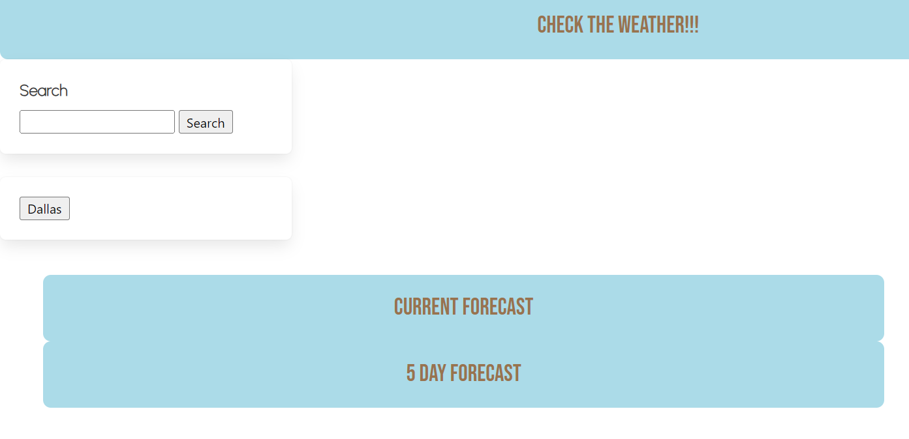

# Weather Dashboard

## Description

This project was designed to help students learn how to use server side APIs to fetch and render data. To that end, I used the openweather API to get weather forecast data for whatever city the user searches. Unfortunately, it doesn't quite work, but I'm pretty sure I can get it running.... eventually.

## Usage

Simply search for the city you want the weather forecast of. Previous searches will be saved in button form under the search bar.

## Credits

This site was built by [Jessica Jones](github.com/distractabee). She used code from the EdX full stack development bootcamp as a reference, as well as code from fellow bootcamp student [Elizabeth Olsavsky](github.com/elizabetholsavsky) for the functions to search city coordinates and fetch weather data

## License

[MIT license](https://mit-license.org/)